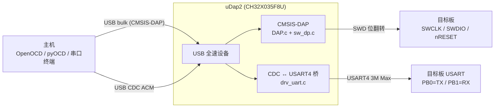

# 第一部分：概览

## 1. 这是什么

一块 RISC-V MCU 做成的「调试器小板」：插上 USB 后主机看到**一个 CMSIS-DAP 探针**和
**一个串口**，两者共用同一颗芯片、同一根 USB 线。它替代的是「J-Link/DAPLink + 独立 USB-TTL」
两件套，用于嵌入式目标板的调试与串口日志。

数据通路：

```mermaid
flowchart LR
    PC["主机<br/>OpenOCD / pyOCD / 串口终端"]
    subgraph DAP["uDap2 (CH32X035F8U)"]
        USBFS["USB 全速设备"]
        DAPC["CMSIS-DAP<br/>DAP.c + sw_dp.c"]
        BR["CDC ↔ USART4 桥<br/>drv_uart.c"]
    end
    TGT["目标板<br/>SWCLK / SWDIO / nRESET"]
    UART["目标板 USART<br/>PB0=TX / PB1=RX"]

    PC -- "USB bulk (CMSIS-DAP)" --> USBFS
    PC -- "USB CDC ACM" --> USBFS
    USBFS --> DAPC
    USBFS --> BR
    DAPC -- "SWD 位翻转" --> TGT
    BR -- "USART4 3M Max" --> UART
```
