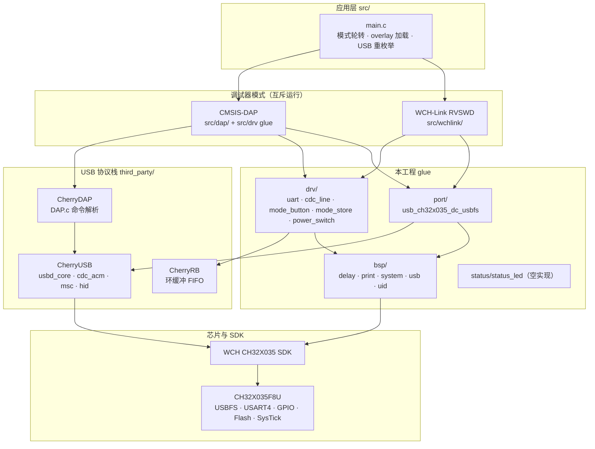

## 7. 整体分层架构

```mermaid
flowchart TB
    subgraph APP["应用层 src/"]
        MAIN["main.c<br/>模式轮转 · overlay 加载 · USB 重枚举"]
    end

    subgraph MODES["调试器模式（互斥运行）"]
        DAP["CMSIS-DAP<br/>src/dap/ + src/drv glue"]
        WCH["WCH-Link RVSWD<br/>src/wchlink/"]
    end

    subgraph GLUE["本工程 glue"]
        BSP["bsp/<br/>delay · print · system · usb · uid"]
        PORT["port/<br/>usb_ch32x035_dc_usbfs"]
        DRV["drv/<br/>uart · cdc_line · mode_button · mode_store · power_switch"]
        ST["status/status_led（空实现）"]
    end

    subgraph STACK["USB 协议栈 third_party/"]
        CUSB["CherryUSB<br/>usbd_core · cdc_acm · msc · hid"]
        CRB["CherryRB<br/>环缓冲 FIFO"]
        CDAP["CherryDAP<br/>DAP.c 命令解析"]
    end

    subgraph HW["芯片与 SDK"]
        SDK["WCH CH32X035 SDK"]
        CHIP["CH32X035F8U<br/>USBFS · USART4 · GPIO · Flash · SysTick"]
    end

    MAIN --> DAP
    MAIN --> WCH
    DAP --> CDAP
    DAP --> DRV
    WCH --> DRV
    DAP --> PORT
    WCH --> PORT
    PORT --> CUSB
    CDAP --> CUSB
    DRV --> CRB
    PORT --> BSP
    DRV --> BSP
    BSP --> SDK
    CUSB --> SDK
    SDK --> CHIP
```

**依赖方向**：`main` → 模式 → glue → 协议栈/SDK。WCH-Link 内部还有严格的分层
（见「模式二：WCH-Link → 分层与依赖方向」），底层模块不反向依赖上层命令。
