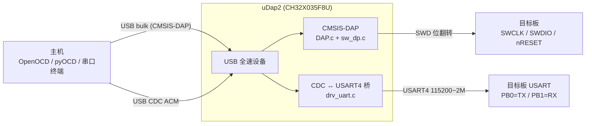

# uDap2

基于 **CH32X035F8U** 的 **CMSIS-DAP 调试器 + USB↔串口桥**，单颗 USB 全速设备口同时提供
SWD 调试和一路虚拟串口。仓库包含固件（`firmware/`）、KiCad 硬件设计（`hardware/`）与上位机
脚本（`software/`）。

- 调试器：CMSIS-DAP（bulk，WinUSB）——OpenOCD / pyOCD / probe-rs 可直接使用
- 桥接串口：CDC ACM，对端是目标板上的 USART4（PB0=TX / PB1=RX），**不限制波特率**
- SWD 时钟：请求 **≥6 MHz** 自动切到「快路径」，实测读写 **125 / 121 KiB/s**（16 KiB 块）
- SWD 推荐档位：**6 MHz**（更快与更快实际同速，填高只减时序余量）
- 串口环回：**2 Mbaud 持续满载零丢字节**（96~98 % 利用率）；分块发送时 6 Mbaud 也字节无误
- 桥接吞吐天花板：约 **200 KiB/s**（≈2 Mbaud），受 USB IN 侧调度限制，与 USB 带宽无关

---

## 1. 这是什么

一块 RISC-V MCU 做成的「调试器小板」：插上 USB 后主机看到**一个 CMSIS-DAP 探针**和
**一个串口**，两者共用同一颗芯片、同一根 USB 线。它替代的是「J-Link/DAPLink + 独立 USB-TTL」
两件套，用于嵌入式目标板的调试与串口日志。

数据通路：



---

## 2. 硬件

### 主控芯片

| 项目 | 参数 |
| --- | --- |
| 型号 | **CH32X035F8U6**（沁恒 WCH，TSSOP-20） |
| 内核 | RISC-V，`rv32imacxw`（RV32IMAC + WCH 扩展，沁恒 QingKe V4 系列） |
| 主频 | 48 MHz，来自内部 HSI RC（无外部晶振），工程内 `CPU_CLOCK = 48000000` |
| Flash | 62 KiB 可用（链接脚本按「62K − 256B」划分，末尾 256B 留给 NV 配置） |
| SRAM | 20 KiB |
| USB | 内置 USB 全速（12 Mbps）设备控制器，DP/DM 固定在 PC16/PC17 |
| 固件体积 | Flash ≈ 26.2 KiB（`.bin` 26816 B）、RAM ≈ 19.1 KiB |

芯片外设在本工程中用到的部分：USBFS、USART4、GPIOA/GPIOB（含 BSHR/BCR 原子置位复位，
SWD 位翻转靠它做到单指令翻转）、SysTick、Flash。

### 板载与引脚分配

| 信号 | 引脚 | 说明 |
| --- | --- | --- |
| SWCLK | PA2 | SWD 时钟 |
| SWDIO | PA3 | SWD 双向数据（CFGLR 动态切输入/输出） |
| nRESET | PA5 | 低有效，复位目标 |
| 桥接串口 | PB0 = TX / PB1 = RX | USART4 |
| 状态灯 | PB12 | 高电平点亮，接 CMSIS-DAP `LED_CONNECTED_OUT` |
| USB | PC16 = DPDM / PC17 = DP | 固定复用 |

> ⚠️ 引脚取自参考工程，**尚未逐条对照 `hardware/uDap.kicad_sch` 核对**，上板前请确认。

USB 描述符（`src/dap/dap_main.c`）：

| 项目 | 值 |
| --- | --- |
| VID:PID | `0d28:0204`（与部分 DAPLink 相同，同插时需按序列号区分） |
| 制造商 / 产品 | `uDAP` / `uDAP CMSIS-DAP` |
| 序列号 | `DEADBEEF` |
| 复合接口 | 接口 0 = CMSIS-DAP 厂商自定义 bulk（MS OS 2.0 描述符自动装 WinUSB）<br/>接口 1/2 = CDC ACM |
| DAP 固件版本 | `0.1.0` |

---

## 3. 技术栈

### 固件

| 层 | 选型 | 说明 |
| --- | --- | --- |
| USB 协议栈 | **CherryUSB** | 上游 submodule，不改动；端口 glue 在 `src/port/` |
| 环形缓冲 | **CherryRB** | `chry_ringbuffer`，USB↔UART 两个方向的 FIFO |
| DAP 协议栈 | **CherryDAP** | CMSIS-DAP 命令解析、SWD 事务层 |
| 芯片 SDK | WCH CH32X035 SDK | Core / Peripheral / Startup / Linker，位于 `sdk/` |
| 语言 | C（gnu11），无 RTOS，裸机主循环 + 中断 | |
| USB 类 | CMSIS-DAP（WinUSB）+ CDC ACM | |
| 自定义 SWD 后端 | `src/dap/sw_dp.c` | 快/慢双路径位翻转，热路径放 RAM |

架构约定：`third_party/` **只放上游 submodule**，针对本板的适配（glue）全部放在
`src/port/`、`src/bsp/`、`src/dap/`、`src/drv/` 与 `src/usb_config.h`，升级依赖不会产生冲突。

### 工具链与构建

| 项目 | 选型 |
| --- | --- |
| 构建系统 | **xmake**（`firmware/xmake.lua`，工程根 = `firmware/`） |
| 编译器 | WCH RISC-V Embedded GCC 12（`riscv-wch-elf-*`，MounRiver Studio 2 自带） |
| 编译选项 | `-march=rv32imacxw -mabi=ilp32 -msmall-data-limit=8 -mno-save-restore`，`-O3 -Wall -std=gnu11`（release） |
| 优化 | LTO + `--gc-sections`；`.highcode` 段启动时从 Flash 搬到 RAM 执行 |
| 辅助脚本 | `firmware/build.ps1`（PowerShell，包了工具链路径与 `--dap=y/n`） |
| 烧录 | `wlink`（WCH 官方）或 `wchisp` |

### 上位机 / 测试脚本

Python（pyserial）+ TCL（OpenOCD）+ PowerShell，全部在 `firmware/tools/`。

### 硬件设计

KiCad 工程：`hardware/uDap.kicad_sch` / `uDap.kicad_pcb`（含 Type-C 子图 `usb_typec.kicad_sch`）。

---

## 4. 功能特性

- **CMSIS-DAP**：SWD 传输，支持 `DAP_Transfer` / `DAP_TransferBlock` / `DAP_ExecuteCommands`；
  nRESET 可控；已实测 OpenOCD 能读写 STM32F411 的 Flash 与 RAM。
- **快/慢双路径 SWD**：请求时钟 < 6 MHz 走慢路径（带可调延时，兼容长线/慢目标）；
  ≥ 6 MHz 走快路径（固定指令数时序，约 6 MHz 实际 SWCLK）。阈值由 CherryDAP 的
  `MAX_SWJ_CLOCK(DELAY_FAST_CYCLES) = (48M/2)/(2+DELAY_FAST_CYCLES)` 决定，
  本工程在 `DAP_config.h` 里把 `DELAY_FAST_CYCLES` 设为 2 → 阈值 **6 MHz**
  （上游默认 0，即 12 MHz）。
- **USB↔串口桥**：CDC ACM 与 USART4 双向搬运，波特率由主机 `SET_LINE_CODING` 实时设定。
- **不限制波特率**：主机下什么速率就设什么（不拒绝、不截断）。USART 是 16 倍过采样，
  `BRR = 48 MHz / 波特率`，标称上限 3 Mbaud；实测 6 Mbaud（BRR=8，USARTDIV<1）也能字节无误。
  详见第 6.4 节。
- **CDC 侧背压**：UART TX FIFO 余量不足时不重挂 OUT 端点，主机 bulk 写被 NAK 挡住，
  主机侧自然阻塞在串口波特率上，**不丢字节**（见第 6.2 节）。
- **状态指示灯**：PB12 显示主机是否已连接（由 `DAP_HostStatus` 驱动）。
- **可裁剪**：`xmake f --dap=n` 可关掉调试器功能，只编 USB 骨架（Flash 12.5 KiB）。

---

## 5. 快速开始

### 构建

```powershell
cd firmware

# 便捷脚本（release，CMSIS-DAP 默认启用）
.\build.ps1
.\build.ps1 -Dap n        # 只编 USB 骨架
.\build.ps1 -Clean        # 先清理

# 或直接用 xmake
$env:WCH_TOOLCHAIN_ROOT = "D:/program/wch/MounRiver_Studio2/resources/app/resources/win32/components/WCH/Toolchain/RISC-V Embedded GCC12"
xmake f -m release -y
xmake -r
```

产物：`firmware/build/release/firmware.elf` / `.bin` / `.map`。

> ⚠️ xmake 会把 option 值持久化到本地配置，构建脚本每次显式传 `--dap=...`；
> 直接敲 xmake 时也请显式指定，否则结果会被上一次的配置决定。

### 烧录

```powershell
wlink flash firmware/build/release/firmware.elf
```

### 使用

```sh
# 调试器（会同时看到 uDAP CMSIS-DAP 探针和一个 CDC 串口）
openocd -f interface/cmsis-dap.cfg -f target/stm32f4x.cfg
probe-rs info --chip stm32f411ceu --probe DEADBEEF

# 串口
python -m serial.tools.miniterm COM21 115200
```

---

## 6. 性能实测

### 6.1 SWD 调试吞吐（频率扫描）

**方法**：`firmware/tools/openocd_speed_test.tcl`（测试块先备份、测完恢复，不破坏目标程序）。

```powershell
# 在仓库根目录执行

# 单点
.\firmware\tools\speed.ps1 -Khz 6000 -Bytes 65536 -Rounds 3

# 整条频率扫描（本次数据即由此产生）
.\firmware\tools\openocd_speed_sweep.ps1 -Rounds 5 -Warmup 1
```

> 两个脚本都带 `-FastMinKhz`（默认 6000），**只用于打印「快/慢路径」标注**，
> 不影响实际速度。它必须与固件 `DAP_config.h` 里的 `DELAY_FAST_CYCLES` 保持一致：
> 阈值 = `24 MHz / (2 + DELAY_FAST_CYCLES)`。改固件阈值时记得同步这个默认值。

**环境**

| 项目 | 值 |
| --- | --- |
| 探针 | 本板 uDAP（`0d28:0204`，序列号 `DEADBEEF`，DAP 固件 `0.1.0`） |
| 目标 | STM32F411CEU6，IDCODE `0x2BA01477` |
| 测试区 | 目标 RAM `0x20000000`（主表 16 KiB；「块大小的影响」另用 64/128 KiB） |
| 主机工具 | OpenOCD 0.11.0+dev-snapshot（MounRiver Studio 2 内置） |
| 统计方式 | 每频率预热 1 轮后连测 5 轮取平均（预热不计入） |

| SWCLK 请求 | 写 (KiB/s) | 读 (KiB/s) | 路径 |
| ---: | ---: | ---: | :--- |
| 100 kHz | 4.6 | 4.7 | 慢 |
| 200 kHz | 8.3 | 8.6 | 慢 |
| 300 kHz | 11.8 | 12.0 | 慢 |
| 400 kHz | 15.0 | 14.8 | 慢 |
| 500 kHz | 18.7 | 18.7 | 慢 |
| 600 kHz | 21.4 | 21.6 | 慢 |
| 800 kHz | 25.2 | 24.0 | 慢 |
| 1000 kHz | 31.7 | 31.4 | 慢 |
| 1500 kHz | 40.8 | 40.3 | 慢 |
| 2000 kHz | 41.2 | 40.3 | 慢 |
| 2500 kHz | 54.3 | 45.8 | 慢（开始饱和） |
| 3000 kHz | 53.8 | 42.8 | 慢（饱和） |
| 4000 kHz | 54.2 | 45.3 | 慢（饱和） |
| 5000 kHz | 53.3 | 45.1 | 慢（饱和） |
| 5750 kHz | 54.1 | 45.5 | 慢（饱和，最后一档） |
| **6000 kHz** | **125.4** | **121.0** | **快（拐点）** |
| 8000 kHz | 126.7 | 121.8 | 快 |
| 10000 kHz | 115.9 | 113.9 | 快 |
| 12000 kHz | 126.3 | 119.0 | 快 |

> 慢路径数值有 ±5 % 波动（同一档重测会在 53 ~ 56 KiB/s 之间浮动），
> 快路径 ±10 %。**不要拿单次测量去比较两版固件。**

曲线（写，KiB/s）：

```
  100 kHz ▏█                                          4.6  ┐
  200 kHz ▏█▊                                         8.3  │
  500 kHz ▏████▏                                     18.7  ├ 慢路径线性区
 1000 kHz ▏██████▊                                  31.7  │  （速度 ∝ 频率）
 1500 kHz ▏█████████                                40.8  ┘
 2000 kHz ▏█████████                                41.2  ┐ 慢路径饱和
 4000 kHz ▏████████████                             54.2  │  （延时被钳到最小值，
 5750 kHz ▏████████████                             54.1  ┘    再提频率无用）
 6000 kHz ▏████████████████████████████▏           125.4    快路径（2.3×）
```

**块大小的影响**（同环境，取每次都能稳定拿到的值）

| 测试块 | 6 MHz 写 | 6 MHz 读 | 5.75 MHz 写（慢） | 5.75 MHz 读（慢） |
| ---: | ---: | ---: | ---: | ---: |
| 16 KiB | **125.4** | **121.0** | 54.1 | 45.5 |
| 64 KiB | 109.5 | 108.0 | — | — |
| 128 KiB | 94.7 | 91.6 | 51.2 | 43.9 |

**块越小越快**（16 KiB 最优），因为每轮都要等一次 USB 往返 + OpenOCD 的命令封装；
块大到一定程度后，往返开销占比下降的收益被别的因素抵消。**测速请固定块大小**。

**结论**

1. **慢路径在约 2.5 MHz 就已经饱和**（≈54 写 / 45 读 KiB/s）。2.5 MHz 到 5.75 MHz 之间
   请求更高的时钟完全没有收益 —— 延时参数已被钳到最小值，实际 SWCLK 不再上升。
2. **6 MHz 是拐点**：跨过阈值切到快路径，写速度 54 → 125 KiB/s（**2.3 倍**），读 45 → 121。
3. **6 MHz 与 12 MHz 的实际速度一样**（快路径的实际 SWCLK 由固定指令数决定，约 6 MHz）。
   每次都能拿到的值在写 104 ~ 127 / 读 102 ~ 122 KiB/s 之间浮动。
   **填 6 MHz 即可**，不必填更高：请求值只影响相对目标的时序余量，不影响速度。
4. **稳定性已强化验证**：6 MHz、128 KiB 块、10 轮全部通过（94.7 / 91.6 KiB/s），
   无 ACK 错误或缺字节。
5. 读速度低于写速度（约 −10 %），因为读操作需要在 SWDIO 上采样并打包，时序更长。
6. 这个数字是「SWD 链路吞吐」，与目标 Flash 编程速度不是一回事 —— 烧 Flash 还要叠加
   目标自身的 Flash 控制器耗时。

### 6.2 COM 口环回吞吐与利用率

**方法**：`firmware/tools/com_loopback_speed.py`。
需要把 DAP 的 **PB0(TX) 与 PB1(RX) 短接**，主机写进 COM 口的字节经
USB→DAP→UART→环回→UART→DAP→USB 回到主机。脚本用两个线程**同时**发与收
（固件 TX FIFO 只有 1 KiB，边写边读才不会撑爆、也不会在被背压挡住时空等），
载荷按波特率自动缩放，收满后**逐字节比对**。

```powershell
python .\firmware\tools\com_loopback_speed.py --seconds 2 --repeats 3
python .\firmware\tools\com_loopback_speed.py --baud 115200,2000000
```

**环境**：COM21（本板 uDAP 的 CDC 口），并已用跳线把 PB0(TX) 与 PB1(RX) 短接。

**两个「利用率」的含义**

- **UART 利用率** = 实测字节率 ÷ (波特率 / 10)。8N1 每字节占 10 个位时间，
  所以 `波特率 / 10` 是串口线的理论上限。这一列回答「串口线有没有被榨干」。
- **USB 利用率** = 双向字节率（收 + 发）÷ 1.216 MB/s。全速 USB 每 1 ms 帧最多
  19 × 64 字节批量载荷，即 1 216 000 B/s。这一列回答「USB 侧还有多少余量」。

**结果**（每档 2 s 目标载荷、3 次取中位）

| 波特率 | 载荷 | 用时 | 实测速度 | UART 线速率 | **UART 利用率** | USB 利用率 |
| ---: | ---: | ---: | ---: | ---: | ---: | ---: |
| 9 600 | 4 KiB | 4.259 s | 961.6 B/s（0.94 KiB/s） | 960 B/s | **100.2 %** | 0.2 % |
| 19 200 | 4 KiB | 2.130 s | 1 923.0 B/s（1.88 KiB/s） | 1 920 B/s | **100.2 %** | 0.3 % |
| 38 400 | 8 KiB | 2.130 s | 3 845.7 B/s（3.76 KiB/s） | 3 840 B/s | **100.2 %** | 0.6 % |
| 57 600 | 12 KiB | 2.129 s | 5 771.0 B/s（5.64 KiB/s） | 5 760 B/s | **100.2 %** | 1.0 % |
| 115 200 | 24 KiB | 2.132 s | 11 526.3 B/s（11.26 KiB/s） | 11 520 B/s | **100.1 %** | 1.9 % |
| 230 400 | 48 KiB | 2.127 s | 23 103.9 B/s（22.56 KiB/s） | 23 040 B/s | **100.3 %** | 3.8 % |
| 460 800 | 92 KiB | 2.038 s | 46 217.3 B/s（45.13 KiB/s） | 46 080 B/s | **100.3 %** | 7.6 % |
| 921 600 | 180 KiB | 1.994 s | 92 427.2 B/s（90.26 KiB/s） | 92 160 B/s | **100.3 %** | 15.2 % |
| 1 000 000 | 196 KiB | 2.004 s | 100 131.1 B/s（97.79 KiB/s） | 100 000 B/s | **100.1 %** | 16.5 % |
| 1 500 000 | 296 KiB | 2.018 s | 150 188.1 B/s（146.67 KiB/s） | 150 000 B/s | **100.1 %** | 24.7 % |
| **2 000 000** | 392 KiB | 2.004 s | 200 277.0 B/s（195.58 KiB/s） | 200 000 B/s | **100.1 %** | 32.9 % |

> 利用率会略高于 100 %（100.1 ~ 100.3 %）。这是因为 CH32X035 的 48 MHz 来自**内部 HSI RC**，
> 实际频率与标称值有零点几百分点的偏差 —— 也就是串口线比标称波特率快了同样的比例。
> 数值 ≥100 % 就说明 UART 侧已被完全榨干，瓶颈不在 DAP 固件。
>
> ⚠️ 本表是「成功跑完的那些轮」的平均值（每档 3 轮取中位），**不代表都能成功**：
> 从 1.9 Mbaud 起会偶发丢字节，2 Mbaud 的成功率约 4 / 10。可靠性问题见 6.3 节。

**结论**

1. **从 9 600 到 2 000 000 baud，UART 利用率始终 ≈100 %** —— 桥接固件在整条波特率
   区间内都不是瓶颈，串口线速就是端到端速度。
2. **USB 侧余量很大**：即使 2 Mbaud，USB 利用率也只有 33 %。
   瓶颈完全在 UART 侧，**不是 USB 带宽**。
3. 但**继续提高波特率不会再加速**：实测桥接的吞吐天花板是 **≈190~200 KiB/s**，
   正好落在 2 Mbaud。限制来自 USB IN 侧：`chry_dap_cdc_bridge()` 每次主循环迭代
   只发起**一次** CDC IN 传输（最多 512 B），且必须等它完成后才能发下一次。
   详见 6.4 节。

### 6.3 持续满载的可靠性边界

上一节的表格是把整块载荷**一次性写出去**（sustained）测的。这种方式下 DAP 的收发是
**持续并发**的，中断负载最高，波特率过高时会**偶发丢字节**（丢的是连续一小段，
典型 50 ~ 170 字节，特征是 DAP 的 RX FIFO 溢出 —— RX 侧没有背压手段）。

每档 2 s 级载荷（约 370~400 KB）、重复 10 次：

| 波特率 | 通过率 | 实测速度 | 结论 |
| ---: | :---: | ---: | :--- |
| 1 800 000 | **10 / 10** | 178 052 B/s（173.9 KiB/s） | 可靠（另有 3 次 1.44 MB 超长测试也全通过） |
| 1 850 000 | 9 / 10 | 184 849 B/s（180.5 KiB/s） | 边缘 |
| 1 900 000 | 6 / 10 | 192 264 B/s（187.8 KiB/s） | 不可靠 |
| 2 000 000 | 4 / 10 | 200 277 B/s（195.6 KiB/s） | 不可靠 |

2 Mbaud 下的丢字节与**持续时长**正相关（同一波特率，缩短载荷即可全通过）：

| 载荷 | 持续时长 | 通过率 |
| ---: | ---: | :---: |
| 8 KiB | 0.04 s | **20 / 20** |
| 64 KiB | 0.33 s | **10 / 10** |
| 128 KiB | 0.65 s | 7 / 8 |
| 256 KiB | 1.3 s | 6 / 8 |
| 512 KiB | 2.6 s | 4 / 6 |

但把发送方式换成**分块 + 等回包**（`com_loopback_paced.py`）后，同一个 2 Mbaud
不仅全通过，速率还更高：

| 发送方式 | 波特率 | 块大小 | 总量 | 结果 | 等效速率 | 利用率 |
| --- | ---: | ---: | ---: | :---: | ---: | ---: |
| 一次性写（sustained） | 2 000 000 | 全部 | 400 KB | 4 / 10 | 195.6 KiB/s | 100.1 % |
| **分块 + 等回包** | 2 000 000 | 4 096 B | 256 KiB | **3 / 3** | **188.7 KiB/s** | **96.6 %** |
| **分块 + 等回包** | 2 000 000 | 4 096 B | 32 KiB | **2 / 2** | **191.3 KiB/s** | **97.9 %** |

**所以：**

- **要长时间零丢字节，首选「分块 + 等回包」的发送方式，并把波特率设在 2 Mbaud**：
  实测 256 KiB 连跑 3 次全部逐字节正确，利用率 96.6 %。
- 如果用**一次性大块写**（持续满载、不自流控），则把波特率降到 **1.8 Mbaud 以内**。
- **根因**是中断 / 排水负载（RX 与 TX 持续并发），不是 FIFO 大小 ——
  把 RX FIFO 从 1 KiB 加到 2 KiB 曾被实测验证过**无改善**（失败形态是「停顿」而非渐进溢出）。

### 6.4 撤除波特率上限之后：高波特率实测

早期固件在 `SET_LINE_CODING` 里对 `> 2 Mbaud` 的请求直接 STALL。现已**撤除该限制**
（见 `dap_main.c` 里「关于 COM 口波特率」的说明），主机下什么速率就设什么。
本节回答两个问题：① UART 到底能产生多高的速率；② 更高的速率有没有用。

#### UART 实际能产生的速率

CH32X035 的 USART 是 **16 倍过采样**，`BRR = fPCLK / 波特率` 必须是整数，
所以实际速率只能落在 `48 MHz / BRR` 这些离散值上（脚本复刻了 SDK `USART_Init()`
的 BRR 算法来推算）：

| 请求波特率 | BRR | UART 实际速率 | 偏差 | 备注 |
| ---: | ---: | ---: | ---: | --- |
| 115 200 | 417 | 115 108 | −0.08 % | |
| 921 600 | 52 | 923 077 | +0.16 % | |
| 1 500 000 | 32 | 1 500 000 | 0.00 % | |
| **2 000 000** | **24** | **2 000 000** | **0.00 %** | 精确，推荐 |
| 2 500 000 | 19 | 2 526 316 | **+1.05 %** | 偏差偏大 |
| 3 000 000 | 16 | 3 000 000 | 0.00 % | USARTDIV = 1，16 倍过采样的**标称上限** |
| 3 500 000 | 14 | 3 428 571 | −2.04 % | BRR < 16，超出规范 |
| 4 000 000 | 12 | 4 000 000 | 0.00 % | BRR < 16，超出规范 |
| 6 000 000 | 8 | 6 000 000 | 0.00 % | BRR < 16，超出规范 |
| 12 000 000 | 4 | 12 000 000 | 0.00 % | BRR < 16，超出规范 |

**BRR < 16 超出规范，但实测仍然能用**（见下面的矩阵）。不过既然速率再高也换不来
吞吐（见本节末），没必要用到那里。

#### 波特率 × 发送块大小矩阵

`com_loopback_matrix.py`：每格发送 32 KiB（192 B / 512 B / 4 096 B 三种块大小），
块间无额外空隙（靠 USB 往返天然拉开），逐字节校验，重复 2 次。
格子 = 通过次数（2/2 = 全通过）：

| 波特率 | 192 B 块 | 512 B 块 | 4 096 B 块 |
| ---: | :---: | :---: | :---: |
| 2 000 000 | 2/2 | 2/2 | **2/2** |
| 2 500 000 | 2/2 | 0/2 | 1/2 |
| 3 000 000 | 2/2 | 0/2 | 0/2 |
| 4 000 000 | 2/2 | 0/2 | 0/2 |
| 6 000 000 | 2/2 | 0/2 | 0/2 |

对应的**等效速率**（KiB/s，括号内为 UART 利用率）：

| 波特率 | 192 B 块 | 512 B 块 | 4 096 B 块 |
| ---: | ---: | ---: | ---: |
| 2 000 000 | 144.0（74.4 %） | 170.5（87.3 %） | **191.3（97.9 %）** |
| 2 500 000 | 140.0（57.4 %） | — | 198.8（81.5 %，仅 1/2） |
| 3 000 000 | 162.8（55.6 %） | — | — |
| 4 000 000 | 163.7（41.9 %） | — | — |
| 6 000 000 | 164.5（28.1 %） | — | — |

更细的块大小扫描（每格 16 KiB、重复 3 次）显示可靠性的**临界粒度在 192 ~ 256 B**
之间，且与波特率基本无关：

| 波特率 | 64 B | 128 B | 192 B | 256 B | 384 B | 512 B |
| ---: | :---: | :---: | :---: | :---: | :---: | :---: |
| 2 500 000 | 3/3 | 3/3 | 2/3 | 1/3 | 2/3 | 1/3 |
| 3 000 000 | 3/3 | 3/3 | 3/3 | 1/3 | 0/3 | 0/3 |
| 4 000 000 | 3/3 | 3/3 | 3/3 | 3/3 | 0/3 | 0/3 |
| 6 000 000 | 3/3 | 3/3 | 3/3 | 1/3 | 0/3 | 0/3 |

#### 关键实验：固定平均速率，只改块大小

「块大了就丢」到底是**瞬间突发太猛**，还是**平均速率太高**？在 2.5 Mbaud 下把
平均速率都固定在约 108 KB/s，只改块大小与间隔：

| 块大小 | 块间空隙 | 平均速率 | 结果 |
| ---: | ---: | ---: | :---: |
| 192 B | 1 ms | ≈108 KB/s | 1 / 2 |
| 384 B | 2 ms | ≈108 KB/s | 0 / 2 |
| 768 B | 4 ms | ≈108 KB/s | 0 / 2 |
| 1 536 B | 8 ms | ≈108 KB/s | 0 / 2 |

**结论：决定成败的是块（突发）大小，不是平均速率** —— 加长空隙并不能补偿更大的块。
换句话说，DAP 的 UART→USB 排水侧来不及把一整块搬走，RX FIFO 在块内就溢出了；
块间的空隙再长也与「块内那一段」无关。

#### 结论：高波特率换不来吞吐

1. **桥接的吞吐天花板是 ≈190 ~ 200 KiB/s**，2 Mbaud 恰好就在这个位置（利用率 98 %）。
   再往上提波特率，**一个字节都多不出来**。
2. 若强制用高波特率，则必须把发送块压到 **≤ 192 B** 才能逐字节无误；
   代价是每块都要等一次 USB 往返，等效速率反而**降到约 165 KiB/s**，
   而且波特率越高利用率越低（6 Mbaud 只有 28 %）。
3. 所以**推荐的档位就是 2 Mbaud**：速率精确（偏差 0.00 %）、正好触到天花板、
   配合分块发送可长时间零丢字节。
4. 限制来自 **USB IN 侧的传输调度**：`chry_dap_cdc_bridge()` 每次主循环只发起一次
   IN 传输且要等它完成，不是 USB 带宽不够 —— 2 Mbaud 时双向合计仅占全速 USB
   批量上限的 33 %。

---

## 7. 已知限制

| 限制 | 说明 |
| --- | --- |
| 吞吐天花板 ≈190~200 KiB/s | 桥接的极限是 USB IN 侧调度，与波特率无关（见 6.4）。**把波特率提到 2 Mbaud 以上不会更快**，反而必须缩小发送块才能不丢字节，等效速率更低。 |
| 高波特率需配分块发送 | ≥2.5 Mbaud 时只有发送块 ≤192 B 才逐字节无误（见 6.4）。持续满载收发（≥1.9 Mbaud）会偶发丢字节 —— RX 方向**没有背压手段**（UART 侧无 RTS/CTS），是并发时真正脆弱的一侧。 |
| 超规范速率 | `BRR < 16`（>3 Mbaud）超出 16 倍过采样规范，实测能用但无收益；且 2.5 Mbaud 等档位的实际速率与请求值偏差可达 1~2 %，接真实目标板时需自行留出容差。 |
| 快路径实际时钟固定 | 快路径的 SWCLK 由指令数决定（约 6 MHz），与请求的 6 ~ 24 MHz 无关；请求越高只是余量越薄。**所以推荐的请求值就是 6 MHz** —— 正好是拐点，余量最厚。 |
| 单颗状态灯 | PB12 接的是 CMSIS-DAP `LED_CONNECTED_OUT`，由主机的 `DAP_HostStatus` 驱动。**OpenOCD 不发该命令 → 灯不亮**；pyOCD 会亮。详见 `firmware/README.md`。 |
| 引脚未核对原理图 | SWD/nRESET/串口引脚取自参考工程，需按 `hardware/uDap.kicad_sch` 复核。 |
| HSI 无晶振 | 波特率/时序精度依赖内部 RC，与标称值有零点几百分比偏差。 |

---

## 8. 目录结构

```
uDap2/
├── readme.md                    本文件：项目总览 + 性能数据
├── firmware/                    固件工程（xmake 工程根）
│   ├── src/                     本工程代码（应用 + 移植 glue）
│   │   ├── main.c               入口（ENABLE_DAP 分两条路径）
│   │   ├── system_ch32x035.c    时钟与系统初始化
│   │   ├── ch32x035_it.c        中断实现
│   │   ├── usb_config.h         CherryUSB 应用侧配置（必选）
│   │   ├── bsp/                 延时 / 打印 / 系统 / USB 硬件初始化
│   │   ├── port/                CherryUSB 的 CH32X035 USBFS 端口 glue
│   │   ├── dap/                 CMSIS-DAP glue（DAP_config.h / dap_main.c / sw_dp.c）
│   │   └── drv/drv_uart.c       CDC ↔ USART4 桥（CherryRB FIFO + 背压）
│   ├── sdk/                     WCH CH32X035 SDK
│   ├── third_party/             仅上游 submodule（cherryusb / cherryrb / cherrydap）
│   ├── docs/                    性能文档与原始 CSV
│   │   ├── performance_stm32f411.md    SWD 基线文档（含 6 MHz 阈值变更记录）
│   │   ├── swd_sweep_fast6m.csv        本文 6.1 节的原始数据（6 MHz 阈值版）
│   │   ├── swd_sweep_16k.csv           同一扫描的旧数据（12 MHz 阈值版，留作对照）
│   │   ├── com_loopback.csv            本文 6.2 节的原始数据
│   │   └── com_loopback_highbaud.csv   本文 6.4 节的原始数据
│   ├── tools/                   测速 / 串口测试脚本
│   ├── xmake.lua                构建脚本
│   └── README.md                固件内部细节（引脚、构建陷阱、与参考工程差异）
├── hardware/                    KiCad 工程（uDap.kicad_sch / uDap.kicad_pcb）
└── software/                    上位机
```

---

## 9. 测试脚本一览

| 脚本 | 用途 |
| --- | --- |
| `firmware/tools/openocd_speed_test.tcl` | 单频率 SWD 内存读写测速（会被 `speed.ps1` / 扫描脚本调用） |
| `firmware/tools/speed.ps1` | 单个 SWCLK 频率的 SWD 测速 |
| `firmware/tools/openocd_speed_sweep.ps1` | **频率扫描**，一次跑一串频率并汇总成表（本文 6.1 节） |
| `firmware/tools/com_loopback_speed.py` | **COM 口环回吞吐 / 利用率**测试，持续满载模式（本文 6.2、6.3 节） |
| `firmware/tools/com_loopback_paced.py` | **分块 / 间隔发送**测试，含 BRR 与实际波特率推算（本文 6.3、6.4 节） |
| `firmware/tools/com_loopback_matrix.py` | **波特率 × 块大小矩阵**扫描，找最小可靠发送粒度（本文 6.4 节） |
| `firmware/tools/uart_*.py` | USART4 桥的连通性 / 全双工 / 流控 / 压力测试 |
| `firmware/tools/dap_probe_check.py` | 探针基本信息检查 |

复现本文数据：

```powershell
# 6.1 SWD 频率扫描（需接好目标板）
.\firmware\tools\openocd_speed_sweep.ps1 -Rounds 5 -Warmup 1

# 6.2 / 6.3 COM 环回，持续满载（需 PB0-PB1 短接）
python .\firmware\tools\com_loopback_speed.py --seconds 2 --repeats 3

# 6.3 / 6.4 分块发送（可用 --chunk / --gap-ms 控制发送粒度）
python .\firmware\tools\com_loopback_paced.py --baud 2000000 --chunk 4096 --total 262144 --repeats 3
python .\firmware\tools\com_loopback_paced.py --baud 6000000 --chunk 192 --total 32768

# 6.4 波特率 × 块大小矩阵
python .\firmware\tools\com_loopback_matrix.py `
    --baud 2000000,2500000,3000000,4000000,6000000 --chunk 192,512,4096 `
    --total 32768 --repeats 2 --csv firmware\docs\com_loopback_highbaud.csv
```

---

## 10. 第三方依赖

```sh
git submodule update --init
```

| submodule | commit | 版本 |
| --- | --- | --- |
| `firmware/third_party/cherryusb` | `0e40349` | v1.6.1-82 |
| `firmware/third_party/cherryrb` | `19ea7c6` | v1.0.0 |
| `firmware/third_party/cherrydap` | `c40bb5a` | HSLinkPro-2.4.2-41 |

均在各自的开源许可下使用；本工程对子模块**不做修改**，所有适配放在 `firmware/src/`。
